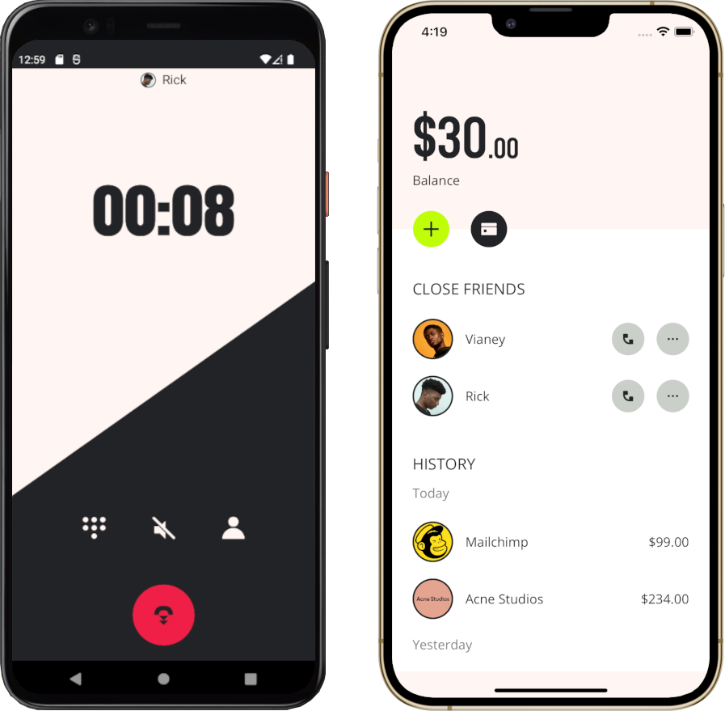
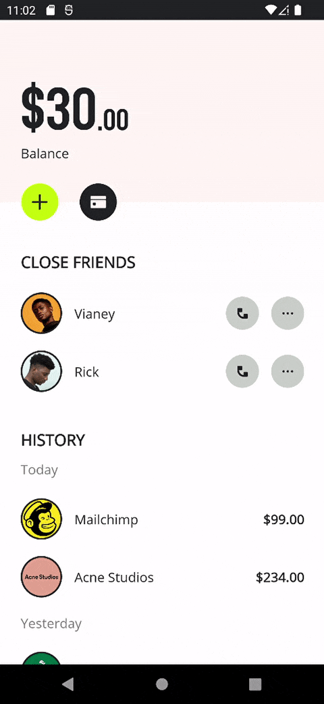
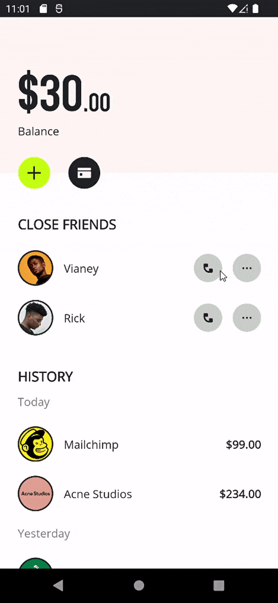
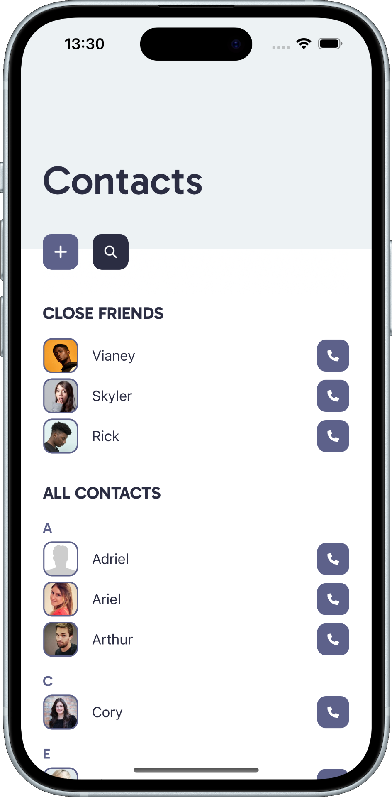
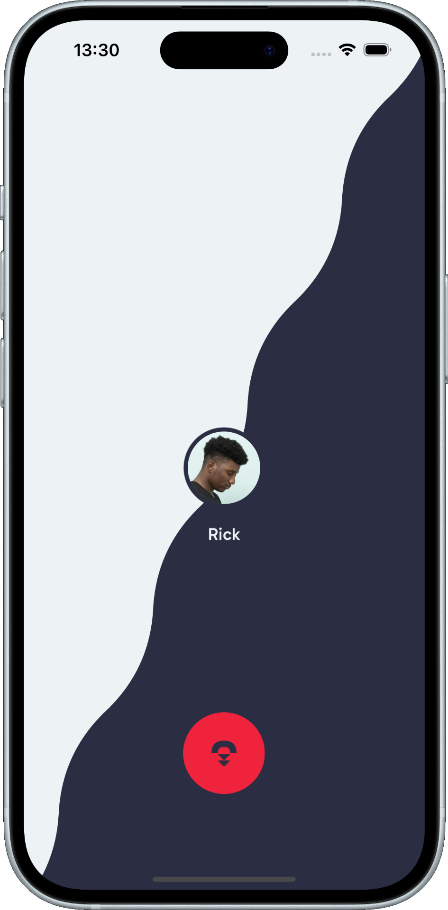
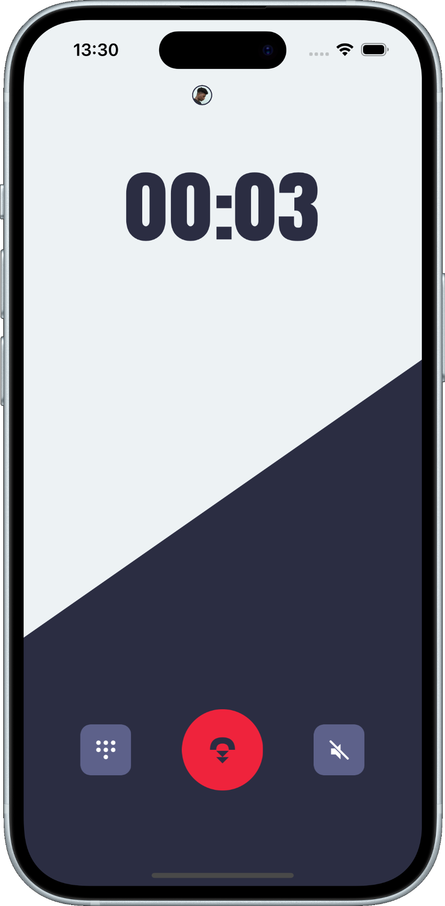
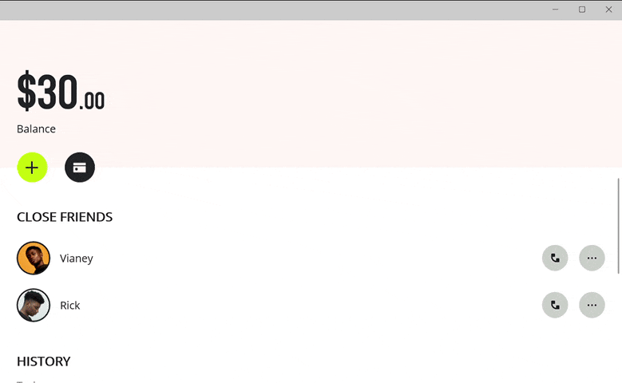

# Calling App
**.NET MAUI** implementation of [majority wallet & calling](https://dribbble.com/shots/14796428-majority-wallet-calling) design by [Hampus Öhman](https://dribbble.com/HampusOhman).

## Original design

## My .NET MAUI implementation

    

The application was built using only .NET MAUI APIs.

### Supported platforms
These are all the platforms I tested the app on:

- Android
- iOS
- Windows

    
    &nbsp;&nbsp;&nbsp;&nbsp;&nbsp;&nbsp;&nbsp;
    

    
    
    

    

### Features

- `GraphicsView`
- Animations
- Use of the new .NET MAUI APIs and controls

